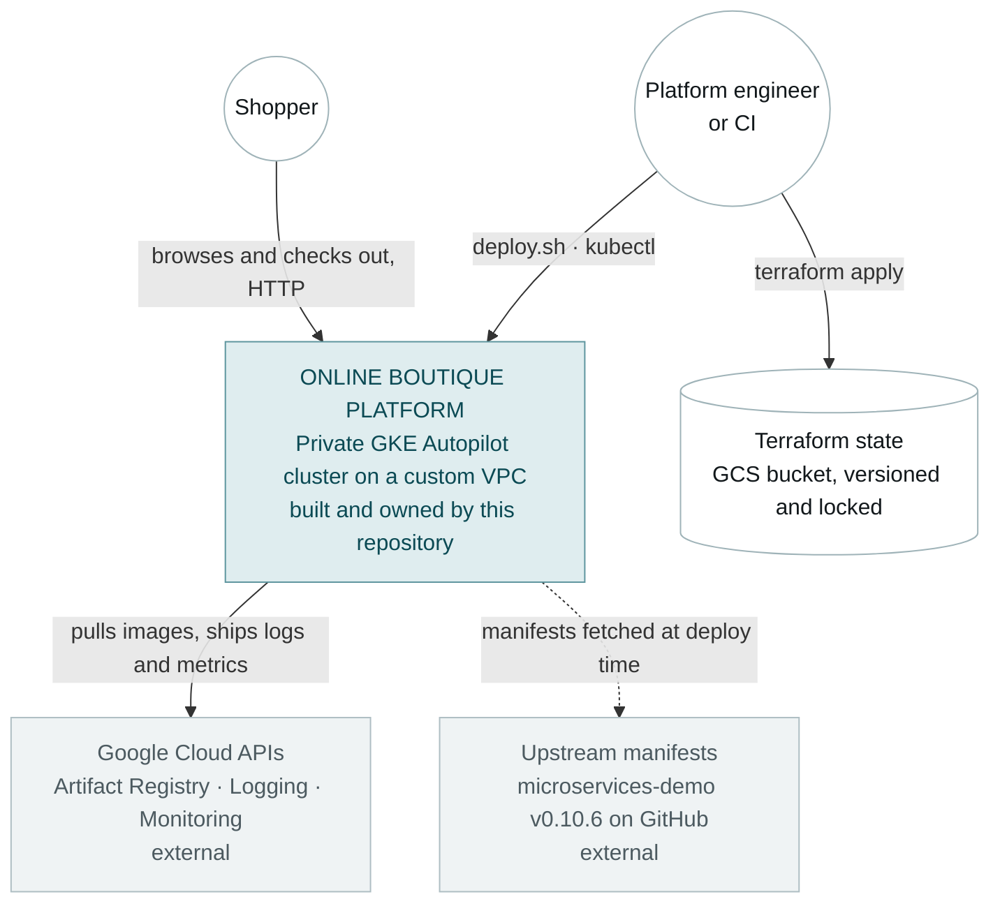
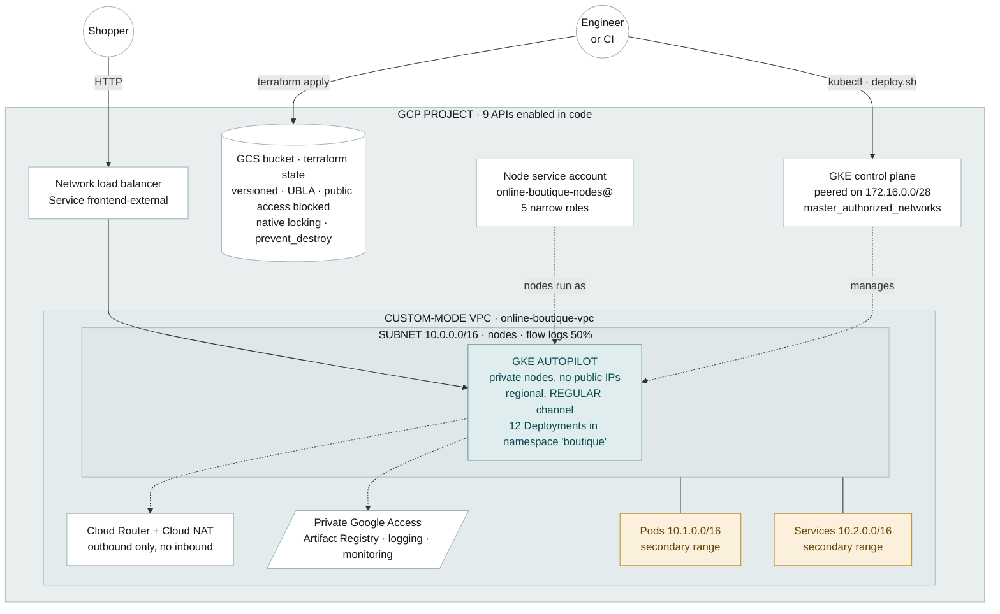
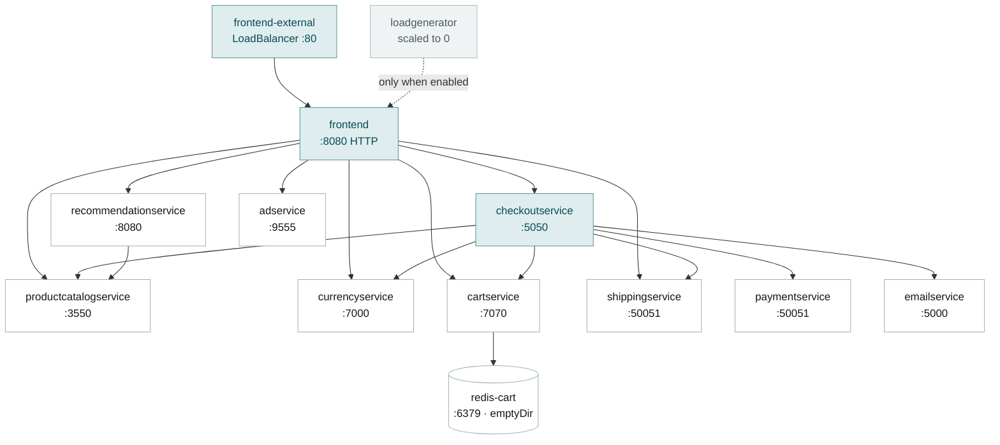

# Architecture

Three views at decreasing altitude — system context, infrastructure containers, application components — then the address plan, the code that builds it, and how it fails. Decisions are recorded separately in [decisions/](decisions/); this document describes *what exists*, and links to *why* rather than restating it.

## Level 1 — system context

Who uses the system, and what it depends on that we do not own.



The only dependency outside Google Cloud is GitHub, and it is used exactly once per deployment to fetch a pinned manifest. Nothing at runtime depends on it.

## Level 2 — infrastructure containers

What Terraform creates inside the project boundary. The only inbound path to a workload is the load balancer the frontend Service asks for; everything else the cluster needs, it reaches outbound.



**Reading it:** solid edges are the shopper's request path; dashed edges are everything the platform does around it — control, identity and egress. Amber marks the three ranges the brief mandated ([R1–R3](01-context.md#mandatory-requirements)).

## Level 3 — application components

The call graph inside the cluster, taken from the `*_SERVICE_ADDR` environment variables in the pinned manifest rather than from the upstream diagram — so it reflects what is actually deployed. All service-to-service traffic is gRPC; only the shopper's traffic is HTTP.



`frontend` and `checkoutservice` are the two fan-out points, and `productcatalogservice` is the most depended-upon service — three callers. That is useful to know before adding NetworkPolicies ([03-security](03-security.md#known-gaps)), because those edges are the allow-list.

### What lands in the cluster

Counted from the pinned `v0.10.6` manifest, applied into the `boutique` namespace — workloads never run in `default`.

| Object | Count | Notes |
|---|---:|---|
| Deployments | 12 | 11 microservices plus `redis-cart` |
| Services | 12 | 11 `ClusterIP` plus `frontend-external`, the one `LoadBalancer` |
| ServiceAccounts | 11 | One per microservice; `redis-cart` runs as `default` |
| NetworkPolicies | 0 | None upstream — see [03-security](03-security.md#known-gaps) |

## Address plan

One subnet, three ranges, bound to the cluster through `ip_allocation_policy` — that binding is what makes the cluster VPC-native rather than routes-based.

| Range | CIDR | Origin | Where it lives |
|---|---|---|---|
| Nodes | `10.0.0.0/16` | **Mandated** | Primary range of `google_compute_subnetwork.gke` |
| Pods | `10.1.0.0/16` | **Mandated** | Secondary range `pods` → `cluster_secondary_range_name` |
| Services | `10.2.0.0/16` | **Mandated** | Secondary range `services` → `services_secondary_range_name` |
| Control plane | `172.16.0.0/28` | *Chosen* | `private_cluster_config.master_ipv4_cidr_block`, non-overlapping |

The sizing is dramatically larger than the workload needs, implemented as specified, with the disagreement recorded rather than silently corrected — see [ADR 0005](decisions/0005-mandated-cidr-sizing.md).

## Repository layout

A thin root that only wires modules together. Each module is a blast-radius boundary and the unit of reuse when this pattern is stamped out per environment.

```
.
├── main.tf                 # API enablement + module wiring, nothing else
├── variables.tf            # Mandated CIDRs as defaults, documented
├── versions.tf             # Pinned providers + GCS backend
├── outputs.tf              # Cluster coordinates + proof of the node SA
├── backend.hcl.example     # Bucket name is supplied at init, not in code
├── bootstrap/              # Run once, local state: the state bucket
├── modules/
│   ├── network/            # VPC, subnet + secondary ranges, Router, NAT
│   └── gke/                # Node SA + IAM, private Autopilot cluster
├── scripts/
│   ├── deploy.sh           # Mock CD: apply + health wait + smoke test
│   └── destroy.sh          # Teardown: K8s LBs first, then terraform destroy
└── docs/                   # These documents; decisions/ holds the ADRs
```

| Path | What it does |
|---|---|
| [main.tf](../main.tf) | Enables 9 APIs with `disable_on_destroy = false`, then wires `network` → `gke`. Destroy removes our resources, not the project's capabilities. |
| [variables.tf](../variables.tf) | Mandated CIDRs as defaults, each annotated. |
| [versions.tf](../versions.tf) | Pins Terraform `>= 1.10` and google `~> 6.0`; declares the `gcs` backend with prefix `online-boutique/root`. The bucket name stays out of code because it is project-specific. |
| [outputs.tf](../outputs.tf) | Cluster name and location, the node SA as proof we are off the Compute default, and a ready-made `get-credentials` command. |
| [bootstrap/main.tf](../bootstrap/main.tf) | Breaks the chicken-and-egg: Terraform needs a remote backend, but something must create the bucket. Versioning, uniform bucket-level access, enforced public-access prevention, `prevent_destroy`, keep-last-10-versions. |
| [modules/network/main.tf](../modules/network/main.tf) | Custom-mode VPC (auto-mode would collide with the mandated plan), subnet with two secondary ranges, Private Google Access, flow logs at 50% sampling, Cloud Router + NAT logging errors only. |
| [modules/gke/main.tf](../modules/gke/main.tf) | Node SA and its five role bindings, then the private regional Autopilot cluster on the REGULAR release channel, with an optional Binary Authorization block. |
| [scripts/deploy.sh](../scripts/deploy.sh) | Fail-fast, non-interactive, idempotent `kubectl apply`, health-gated `kubectl wait`, real HTTP smoke test, manifests pinned to a release tag. |
| [scripts/destroy.sh](../scripts/destroy.sh) | Deletes the namespace before Terraform runs, so load balancer forwarding rules created outside Terraform's knowledge cannot block VPC deletion. |

## Failure modes

What breaks, what the blast radius is, and how it presents. Operational responses are in [04-runbook](04-runbook.md#troubleshooting).

| Failure | Blast radius | How it presents |
|---|---|---|
| Zone loss | None expected | Regional cluster; control plane and workloads span three zones. Pods reschedule. |
| Region loss | Total outage | Single region by design — see [non-goals](01-context.md#non-goals). Recovery is re-apply elsewhere, which is fast because it is all code. |
| Control plane unreachable | Management only | Authorized-network misconfiguration or a private-endpoint switch. Running workloads keep serving; `kubectl` and `terraform` stop working. |
| Cloud NAT port exhaustion | Egress-wide | Image pulls on new nodes fail and outbound calls time out. NAT logging is `ERRORS_ONLY`, so it shows up there first. |
| `redis-cart` Pod restart | All carts emptied | `emptyDir`; upstream's design. Nothing alerts on it. |
| Autopilot scale-up delay | Latency on burst | Pods sit `Pending` while a node is provisioned — the trade for not managing node pools. |
| Regional quota exhausted | Apply fails | Trial accounts hit `CPUS` or `IN_USE_ADDRESSES` first. No partial-cluster state; re-apply after a quota bump. |
| State lock left held | All applies blocked | A crashed apply leaves the GCS lock object. Deliberate: blocking is the safe failure. Cleared with `terraform force-unlock`. |
| Namespace deleted before `terraform destroy` | Orphaned forwarding rules | Precisely what [destroy.sh](../scripts/destroy.sh) sequences around; run out of order and the VPC delete fails. |
