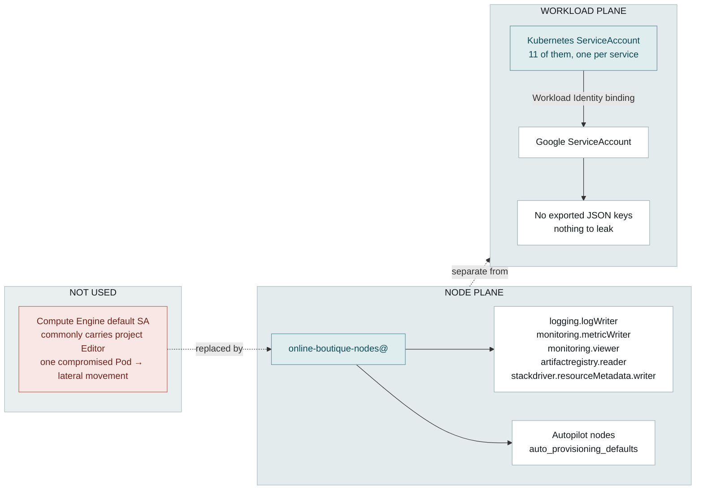

# Security posture

What this environment defends against, how, and — stated as plainly — where it does not. The gaps are listed because an undisclosed gap is worth less than a disclosed one.

## Threat model

Informal, but explicit about scope. The realistic adversary here is someone who achieves code execution inside a Pod, either through an application vulnerability or a compromised dependency.

| In scope | Control |
|---|---|
| Compromised Pod pivoting to the cloud project | Dedicated node service account with 5 narrow roles; no `roles/editor` anywhere in the identity chain — [ADR 0003](decisions/0003-dedicated-node-service-account.md) |
| Direct inbound access to workloads | Private nodes, no external IPs; the only ingress is a load balancer we deliberately create — [ADR 0002](decisions/0002-private-nodes-public-endpoint.md) |
| Node compromise via the host | Autopilot: no SSH, no privileged Pods, Shielded nodes, Google-managed patching on the REGULAR channel |
| Credential theft from the filesystem | No service-account JSON keys exist anywhere in the design |
| Terraform state disclosure | Uniform bucket-level access, enforced public-access prevention, versioning |
| Concurrent-apply corruption | Native GCS state locking — [ADR 0004](decisions/0004-gcs-remote-state.md) |

| Explicitly out of scope | Why |
|---|---|
| Malicious insider with project IAM | No separation-of-duties model, no break-glass, no Access Approval |
| Application-layer attack (XSS, injection, cart tampering) | Upstream demo code, applied unmodified — see [non-goals](01-context.md#non-goals) |
| DDoS | No Cloud Armor; the demo front door is a plain L4 load balancer |
| Supply-chain compromise of upstream images | Mitigated only partially — see below |
| Data exfiltration via egress | Cloud NAT permits all outbound; no VPC Service Controls, no egress filtering |

## Identity: two planes

The single highest-leverage decision is refusing a default. Out of the box, GKE nodes run as the Compute Engine default service account, which commonly carries project Editor — so one compromised Pod inherits near-project-admin lateral movement.

The node plane gets exactly the five roles Google documents as the minimum for a functioning node — logs, metrics, monitoring read, image pull, resource metadata — and nothing else.

> [!important] The workload plane shows the mechanism, not a configured binding
> Autopilot enables Workload Identity, and the upstream manifests create a Kubernetes ServiceAccount per service. **This deployment binds none of them to a Google service account, because Online Boutique never calls a Google API.**
>
> That is the honest position: the plane exists and is ready, and the moment a workload needs Cloud SQL or Pub/Sub, the binding is where its credentials come from — never an exported JSON key. If someone asks to see a binding, there isn't one, and there shouldn't be.

## Network posture

| Control | State | Detail |
|---|---|---|
| Node external IPs | None | `enable_private_nodes = true` |
| Inbound | One path | `frontend-external`, a `LoadBalancer` Service created by the manifest |
| Egress | NAT only | Cloud Router + Cloud NAT, `ERRORS_ONLY` logging |
| Google API access | Private | Private Google Access on the subnet — image pulls and telemetry never traverse the public internet |
| Control plane | Public, filtered | `master_authorized_networks`, currently `0.0.0.0/0` — [ADR 0002](decisions/0002-private-nodes-public-endpoint.md) |
| East-west | Unrestricted | No NetworkPolicy — see below |
| Observability | Sampled | VPC flow logs at 50%, 5-minute aggregation, all metadata |

## Workload hardening

Inherited from upstream and worth crediting, because it is why the manifests apply cleanly under Autopilot's restrictions with no patching. Every container in the pinned manifest runs:

- `runAsNonRoot: true`, `runAsUser: 1000`, `fsGroup: 1000`
- `readOnlyRootFilesystem: true`
- `allowPrivilegeEscalation: false`, `privileged: false`
- `capabilities: drop: [ALL]`

Autopilot would reject privileged Pods, host mounts and host networking regardless — the platform enforces the floor rather than trusting the manifest to.

## Supply chain

| Link | State |
|---|---|
| Manifest provenance | Pinned to release tag `v0.10.6` rather than a branch, so the same command deploys the same objects — [ADR 0007](decisions/0007-pin-manifests-to-release-tag.md) |
| Image provenance | Upstream published images, referenced by tag. Not by digest, and not signed |
| Admission control | Binary Authorization wired but disabled, because unsigned images would be rejected — [ADR 0006](decisions/0006-binary-authorization-off-by-default.md) |
| Vulnerability scanning | None. Artifact Analysis is the paid answer |
| Provider integrity | `.terraform.lock.hcl` pins provider checksums across machines and CI |

The honest summary: the *delivery path* is reproducible, the *artefacts* are trusted because Google publishes them, not because anything verifies them.

## Known gaps

Ranked by what I would fix first.

1. **No NetworkPolicy.** Every Pod can reach every other Pod, so a compromised `adservice` can talk to `redis-cart` directly. Default-deny per namespace plus allow-rules along the edges in the [component diagram](02-architecture.md#level-3--application-components) is the fix, and that diagram exists partly to make writing them mechanical.
2. **`master_authorized_networks` is `0.0.0.0/0`.** Reachability is still gated by IAM, so this is exposure rather than access — but it is exposure that exists only to keep a demo reproducible.
3. **No admission control in force.** Anything with cluster write access can deploy any image.
4. **Images by tag, not digest.** Tags are mutable; a digest would make the deployment bit-identical over time.
5. **No egress restriction.** A compromised Pod can reach the internet through NAT. VPC Service Controls or an egress proxy is the answer where exfiltration is a stated concern.
6. **`deletion_protection = false`** on the cluster, for demo teardown. It stays on in production and deletion goes through change control.

Every one of these is a deliberate trade for reviewability, recorded here rather than discovered later. Production paths for all of them are in [06-roadmap](06-roadmap.md).
