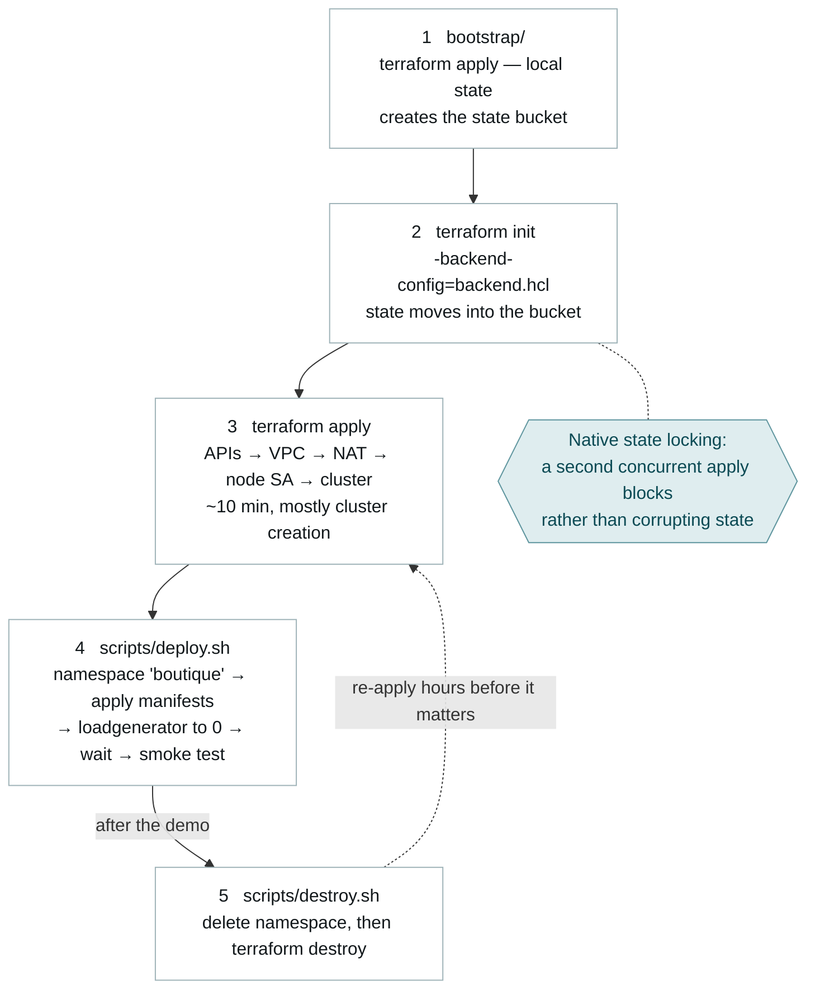

# Runbook

Everything needed to take an empty project to a working shop and back again. This document is task-oriented — the reasoning behind these steps lives in [02-architecture](02-architecture.md) and [decisions/](decisions/).

Commands run in both `bash` and `fish`. Variables are written `"$PROJECT_ID"` rather than `"${PROJECT_ID}"` because fish rejects the braced form. The two constructs that genuinely differ — setting a variable, and prefixing a command with one — carry a `# fish:` line beneath them. The scripts declare `#!/usr/bin/env bash` themselves, so they run the same way from either shell.

## Order of operations

Each step creates the precondition for the next, which is why this one is numbered.



Step 1 uses local state and is irrelevant thereafter — the bucket it creates is protected by `prevent_destroy`, so tearing the platform down and re-applying later resumes at step 3.

## Prerequisites

> [!tip] The scripted path
> [scripts/setup.sh](../scripts/setup.sh) performs every step in this section — tooling check, authentication, project, billing, ADC, bootstrap APIs and Terraform validation — and each step checks before it acts, so it is safe to re-run.
>
> ```bash
> ./scripts/setup.sh <PROJECT_ID> <BILLING_ACCOUNT_ID>
> ```
>
> It creates nothing in Google Cloud; the state bucket and the platform remain `terraform apply`'s job. The rest of this section is what it does and why, for when a step fails or you would rather drive it by hand.

### Tooling

```bash
# Arch / CachyOS. Adjust for your distribution.
sudo pacman -S terraform kubectl
paru -S google-cloud-cli google-cloud-cli-gke-gcloud-auth-plugin
```

> [!warning] The GKE auth plugin is not optional
> Since kubectl 1.26, the kubeconfig written by `gcloud container clusters get-credentials` shells out to `gke-gcloud-auth-plugin`. Without it, every `kubectl` call in [deploy.sh](../scripts/deploy.sh) fails on credentials, and the error does not name the missing binary clearly.

Terraform must be `>= 1.10` ([versions.tf](../versions.tf)).

### Validate the code first

This needs no credentials, no billing and no project, so it runs the moment the clone finishes — before a single Google Cloud resource exists.

```bash
# bootstrap/ and the root are independent modules; check both
cd bootstrap && terraform init -backend=false && terraform validate && cd ..

terraform init -backend=false
terraform fmt -check -recursive
terraform validate
```

`-backend=false` skips backend initialisation, which is what makes this possible before the state bucket exists. A schema or wiring error surfaces here in seconds rather than eight minutes into a cluster create.

### Project and billing

```bash
export PROJECT_ID=your-project-id
# fish: set -x PROJECT_ID your-project-id

gcloud auth login
gcloud projects create "$PROJECT_ID"
gcloud billing accounts list
gcloud billing projects link "$PROJECT_ID" --billing-account=XXXXXX-XXXXXX-XXXXXX
gcloud config set project "$PROJECT_ID"
```

Billing must be linked even on trial credits — GKE, Cloud NAT and the load balancer all refuse to create without it.

### Credentials

```bash
gcloud auth application-default login
gcloud auth application-default set-quota-project "$PROJECT_ID"
```

> [!failure] These are two different credentials
> `gcloud auth login` authenticates the CLI. Terraform uses Application Default Credentials, which is separate. Skipping the second command is the single most common first-apply failure.

### Bootstrap APIs

```bash
gcloud services enable serviceusage.googleapis.com cloudresourcemanager.googleapis.com
```

[main.tf](../main.tf) enables nine APIs in code, but Terraform needs Service Usage already enabled to make those calls. Fresh projects usually have it; being explicit costs nothing and removes the chicken-and-egg.

## Deploy

```bash
# 1. State bucket — local state, once per project
cd bootstrap && terraform init && terraform apply -var="project_id=$PROJECT_ID" && cd ..

# 2. Point the root module at that bucket
sed "s/YOUR_PROJECT_ID/$PROJECT_ID/" backend.hcl.example > backend.hcl
terraform init -backend-config=backend.hcl

# 3. Platform — ~10 minutes, mostly cluster creation
terraform apply -var="project_id=$PROJECT_ID"

# 4. Application
./scripts/deploy.sh "$PROJECT_ID"
```

`deploy.sh` prints the shop's URL on success, having already checked it returns HTTP 200.

Useful variations:

```bash
# Run the load generator for a live autoscaling demo (costs money while up)
DEPLOY_LOADGENERATOR=true ./scripts/deploy.sh "$PROJECT_ID"
# fish: env DEPLOY_LOADGENERATOR=true ./scripts/deploy.sh $PROJECT_ID

# Try a different upstream release
MANIFEST_VERSION=v0.10.5 ./scripts/deploy.sh "$PROJECT_ID"
# fish: env MANIFEST_VERSION=v0.10.5 ./scripts/deploy.sh $PROJECT_ID

# Lock the control plane to your own address instead of 0.0.0.0/0
terraform apply -var="project_id=$PROJECT_ID" \
  -var='authorized_networks=[{cidr_block="203.0.113.4/32",display_name="office"}]'
```

## Proving it works

Claims a reviewer can check in under a minute, rather than take on trust. Each maps to a success criterion in [01-context](01-context.md#what-done-looks-like).

```bash
# Private nodes -> True
gcloud container clusters describe online-boutique --region europe-west4 \
  --format='value(privateClusterConfig.enablePrivateNodes)'

# The mandated secondary ranges are actually bound to the cluster
gcloud container clusters describe online-boutique --region europe-west4 \
  --format='value(ipAllocationPolicy.clusterSecondaryRangeName,
                  ipAllocationPolicy.servicesSecondaryRangeName)'

# Nodes carry no external IPs — the NAT column comes back empty
gcloud compute instances list \
  --format='table(name, networkInterfaces[0].accessConfigs[0].natIP)'

# We are not on the Compute Engine default service account
terraform output node_service_account

# The roles that account actually holds — expect exactly five
gcloud projects get-iam-policy "$PROJECT_ID" \
  --flatten='bindings[].members' \
  --filter="bindings.members:online-boutique-nodes@" \
  --format='value(bindings.role)'

# Every workload healthy, in its own namespace
kubectl get pods --namespace boutique

# State locking is real: run this during an apply and watch it block
terraform plan -var="project_id=$PROJECT_ID"
```

## Troubleshooting

| Symptom | Cause | Fix |
|---|---|---|
| `Error 403: ... API has not been used` | API enablement is asynchronous | Re-run `terraform apply`; it is idempotent |
| `Quota 'CPUS' exceeded` / `IN_USE_ADDRESSES` | Trial-account regional quota | *IAM & Admin → Quotas*, request an increase, or upgrade the account — credits survive the upgrade |
| `google: could not find default credentials` | ADC never created | `gcloud auth application-default login` |
| `no Auth Provider found for name "gcp"` or a missing plugin | `gke-gcloud-auth-plugin` absent | Install it, then re-run `get-credentials` |
| `Error acquiring the state lock` | A previous apply crashed holding the lock | Confirm nobody else is applying, then `terraform force-unlock <LOCK_ID>` |
| `kubectl` times out | Your address is outside `master_authorized_networks` | Re-apply with your CIDR, or widen it temporarily |
| Pods stuck `Pending` | Autopilot is provisioning capacity | Wait; if it persists, check for a resource-ratio rejection in `kubectl describe pod` |
| `deploy.sh` times out waiting for the LB IP | Load balancer provisioning is slow or quota-blocked | `kubectl get svc frontend-external --namespace boutique --watch` |
| `terraform destroy` fails deleting the VPC | Kubernetes-created forwarding rules still exist | Delete the namespace first — which is what [destroy.sh](../scripts/destroy.sh) does |

## Teardown

```bash
# From the repository root
./scripts/destroy.sh "$PROJECT_ID"
```

> [!failure] Run it from the repository root
> [destroy.sh](../scripts/destroy.sh) calls bare `terraform destroy` with no `-chdir`, so from anywhere else it acts on the wrong state — or none at all.

Order matters: the namespace goes first so that load balancer forwarding rules, created by Kubernetes and invisible to Terraform, are gone before the VPC delete. The state bucket survives by design (`prevent_destroy`), so the next run starts at step 3.

Tear down after every working session. Cloud NAT and the load balancer bill while idle whether or not anyone is shopping — see [05-cost](05-cost.md).
