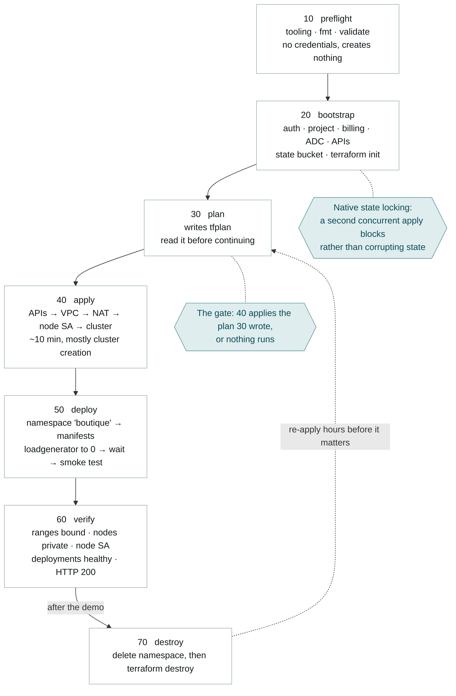

# Runbook

Everything needed to take an empty project to a working shop and back again. This document is task-oriented — the reasoning behind these steps lives in [02-architecture](02-architecture.md) and [decisions/](decisions/).

## The stages

Seven numbered scripts under [scripts/](../scripts/). The number is the order; there is no runner and no build tool, so a person, a Cloud Build step, a GitHub Actions job or an Argo hook can drive them without anything being ported first.

| Stage | Script | Does | Lifecycle phase |
|---|---|---|---|
| 10 | `10-preflight.sh` | Tooling, formatting, `terraform validate` | Test — no credentials, creates nothing |
| 20 | `20-bootstrap.sh` | Auth, project, billing, ADC, APIs, state bucket, `init` | Provision the ground floor |
| 30 | `30-plan.sh` | Writes a reviewable `tfplan` | Release gate — [ADR 0008](decisions/0008-explicit-plan-gate.md) |
| 40 | `40-apply.sh` | Applies exactly that plan | Deploy — infrastructure |
| 50 | `50-deploy.sh` | Manifests, health gate, smoke test | Deploy — application |
| 60 | `60-verify.sh` | Asserts every requirement, exits non-zero on failure | Test and monitor |
| 70 | `70-destroy.sh` | Namespace first, then `terraform destroy` | Operate — teardown |

Every stage that needs a project takes `PROJECT_ID` as its first argument — 10 takes none because it touches nothing, 40 takes none because the plan file already carries the variables, and 20 also takes the billing account. Each is safe to re-run and exits non-zero on failure. That uniformity is what makes them a pipeline without a pipeline tool.



Stage 20 runs once per project. The bucket it creates is protected by `prevent_destroy`, so tearing the platform down and rebuilding later resumes at stage 30.

## Prerequisites

One thing no script can do for you, because it needs root and differs per distribution:

```bash
# Arch / CachyOS. Adjust for your distribution.
sudo pacman -S terraform kubectl
paru -S google-cloud-cli google-cloud-cli-gke-gcloud-auth-plugin
```

> [!warning] The GKE auth plugin is not optional
> Since kubectl 1.26, the kubeconfig written by `gcloud container clusters get-credentials` shells out to `gke-gcloud-auth-plugin`. Without it, every `kubectl` call in [50-deploy.sh](../scripts/50-deploy.sh) fails on credentials, and the error does not name the missing binary clearly.

Terraform must be `>= 1.10` ([versions.tf](../versions.tf)). Stage 10 checks all four binaries and names every one that is missing.

You also need a project that exists and a billing account ID. Stage 20 links the billing account but will not create the project — creation depends on org policy, folder placement and quota that vary per account, so it reports the command instead of guessing.

```bash
gcloud projects create your-project-id     # if it does not exist yet
gcloud billing accounts list               # to find the billing account ID
```

## Deploy

```bash
export PROJECT_ID=your-project-id
# fish: set -x PROJECT_ID your-project-id

./scripts/10-preflight.sh
./scripts/20-bootstrap.sh "$PROJECT_ID" XXXXXX-XXXXXX-XXXXXX
./scripts/30-plan.sh "$PROJECT_ID"        # read the plan before continuing
./scripts/40-apply.sh                      # ~10 min
./scripts/50-deploy.sh "$PROJECT_ID"
./scripts/60-verify.sh "$PROJECT_ID"
```

The scripts resolve the repository root from their own location, so they work from any directory.

Stage 50 prints the shop's URL, having already checked it returns HTTP 200. Stage 60 then asserts every requirement independently and fails loudly if one does not hold.

Useful variations:

```bash
# Run the load generator for a live autoscaling demo (costs money while up)
DEPLOY_LOADGENERATOR=true ./scripts/50-deploy.sh "$PROJECT_ID"
# fish: env DEPLOY_LOADGENERATOR=true ./scripts/50-deploy.sh $PROJECT_ID

# Try a different upstream release
MANIFEST_VERSION=v0.10.5 ./scripts/50-deploy.sh "$PROJECT_ID"
# fish: env MANIFEST_VERSION=v0.10.5 ./scripts/50-deploy.sh $PROJECT_ID

# Lock the control plane to your own address instead of 0.0.0.0/0
terraform plan -out=tfplan -var="project_id=$PROJECT_ID" \
  -var='authorized_networks=[{cidr_block="203.0.113.4/32",display_name="office"}]'
terraform apply tfplan
```

## Why the stages are cut where they are

Each boundary is a change in what can go wrong, not a narrative convenience.

**10 needs nothing.** No credentials, no project, no billing. It runs the moment someone clones, so a broken checkout costs seconds rather than eight minutes into a cluster create. `terraform init -backend=false` is what makes validation possible before the state bucket exists.

**20 is the only stage that creates something cheap.** A backend cannot create its own bucket, so [bootstrap/](../bootstrap/main.tf) runs with local state and makes it. Stage 20 then writes `backend.hcl` and initialises the root module against it. The bucket costs pennies and never gets destroyed.

> [!failure] Two different credentials
> `gcloud auth login` authenticates the CLI. Terraform reads Application Default Credentials, which is separate. Stage 20 sets up both because skipping the second is the single most common first-apply failure.

Terraform also needs Service Usage enabled before it can enable the other nine APIs in code, which is why stage 20 turns that one on with `gcloud` first.

**30 and 40 are separate on purpose.**

> [!important] Why the plan is saved rather than confirmed at the prompt
> Bare `terraform apply` prints a plan and waits for `yes`, but it re-plans at the moment you answer — so what executes is not strictly what you read. `apply tfplan` executes the reviewed plan or fails.
>
> The saved plan is also the only artefact this repository produces that can be reviewed *before* the change: attachable to a pull request, readable by someone who is not at the keyboard. Until [real CI](06-roadmap.md#4-real-cicd-replacing-the-mock) provides a pipeline gate, this is the gate. `tfplan` and `*.tfplan` are both gitignored — plans can embed sensitive values.

**60 exists so the claims are checkable by machine.** Every other document in this repository asserts that the requirements are met. Stage 60 proves it, and returns a non-zero exit code when it cannot.

## Proving it works

```bash
./scripts/60-verify.sh "$PROJECT_ID"
```

Every mandated requirement asserted, grouped by requirement, each mapping to a success criterion in [01-context](01-context.md#what-done-looks-like). It reports everything wrong in one pass rather than stopping at the first failure.

Two are worth understanding rather than trusting:

**The ranges are bound, not merely present.** A subnet can carry `10.1.0.0/16` while the cluster ignores it. Stage 60 checks the CIDRs on the subnet *and* that `ipAllocationPolicy` points at them, which is what makes the cluster VPC-native rather than routes-based.

**Nodes actually run as the dedicated service account.** `terraform output node_service_account` proves the account was created, nothing more. Stage 60 reads `autoscaling.autoprovisioningNodePoolDefaults.serviceAccount` off the cluster — the account Autopilot actually provisions nodes with — because Autopilot does not surface its node VMs as listable Compute instances. That is the failure [ADR 0003](decisions/0003-dedicated-node-service-account.md) warns about: omit the Autopilot wiring and you get a cluster that looks least-privilege while its nodes use the Compute Engine default.

The same checks by hand, if you would rather see them individually:

```bash
gcloud container clusters describe gcp-deploy --region europe-west4 \
  --format='value(privateClusterConfig.enablePrivateNodes,
                  ipAllocationPolicy.clusterSecondaryRangeName,
                  ipAllocationPolicy.servicesSecondaryRangeName)'

# The account Autopilot provisions nodes with, not the Compute Engine default
gcloud container clusters describe gcp-deploy --region europe-west4 \
  --format='value(autoscaling.autoprovisioningNodePoolDefaults.serviceAccount)'

# Nodes carry no external IPs. Autopilot node VMs are not listable Compute
# instances, so ask the Kubernetes API instead — any output at all is a finding.
kubectl get nodes \
  --output=jsonpath='{range .items[*]}{.status.addresses[?(@.type=="ExternalIP")].address}{"\n"}{end}'

# The roles that account actually holds — expect exactly five
gcloud projects get-iam-policy "$PROJECT_ID" \
  --flatten='bindings[].members' \
  --filter="bindings.members:gcp-deploy-nodes@" \
  --format='value(bindings.role)'

# Every workload healthy, in its own namespace
kubectl get pods --namespace boutique

# State locking is real: run this during an apply and watch it block
terraform plan -var="project_id=$PROJECT_ID"
```

## Troubleshooting

| Symptom | Cause | Fix |
|---|---|---|
| `Error 403: ... API has not been used` | API enablement is asynchronous | Re-run stages 30 and 40; both are idempotent |
| `Quota 'CPUS' exceeded` / `IN_USE_ADDRESSES` | Trial-account regional quota | *IAM & Admin → Quotas*, request an increase, or upgrade the account — credits survive the upgrade |
| `google: could not find default credentials` | ADC never created | Re-run stage 20, or `gcloud auth application-default login` |
| `no Auth Provider found for name "gcp"` or a missing plugin | `gke-gcloud-auth-plugin` absent | Install it, then re-run stage 50 |
| `no tfplan found` | Stage 40 run before stage 30 | Run `./scripts/30-plan.sh "$PROJECT_ID"` |
| `Saved plan is stale` | State moved between stages 30 and 40 | The gate working. Re-plan and read it again |
| `Error acquiring the state lock` | A previous apply crashed holding the lock | Confirm nobody else is applying, then `terraform force-unlock <LOCK_ID>` |
| `kubectl` times out | Your address is outside `master_authorized_networks` | Re-plan and apply with your CIDR, or widen it temporarily |
| Pods stuck `Pending` | Autopilot is provisioning capacity | Wait; if it persists, check for a resource-ratio rejection in `kubectl describe pod` |
| Stage 50 times out waiting for the LB IP | Load balancer provisioning is slow or quota-blocked | `kubectl get svc frontend-external --namespace boutique --watch` |
| `terraform destroy` fails deleting the VPC | Kubernetes-created forwarding rules still exist | Delete the namespace first — which is what stage 70 does |

## Teardown

```bash
./scripts/70-destroy.sh "$PROJECT_ID"
```

Order matters: the namespace goes first so that load balancer forwarding rules, created by Kubernetes and invisible to Terraform, are gone before the VPC delete. Watch that step succeed — if it times out the script continues anyway, and the orphaned rules will block the VPC.

The state bucket survives by design (`prevent_destroy`), as do the enabled APIs, so the next run resumes at stage 30.

Confirm nothing is left:

```bash
gcloud container clusters list
gcloud compute instances list
gcloud compute forwarding-rules list
gcloud compute addresses list
```

Tear down after every working session. Cloud NAT and the load balancer bill while idle whether or not anyone is shopping — see [05-cost](05-cost.md).
