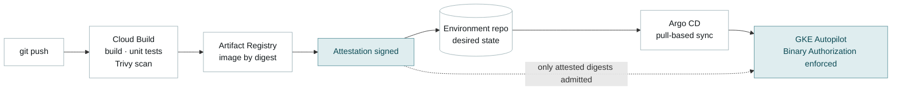

# Roadmap

What I would do next, ranked by value per unit of effort rather than by how impressive it sounds. Each item names the gap it closes, so the list can be argued with rather than just admired.

## Next, in order

### 1. Default-deny NetworkPolicy between the microservices

**Closes:** [gap 1](03-security.md#known-gaps) — every Pod can currently reach every other Pod.
**Effort:** hours. The allow-list is already drawn: it is the [component diagram](02-architecture.md#level-3--application-components), derived from the manifest's own service-address variables.
**Why first:** it is the largest reduction in blast radius available for the least work, and it demonstrates east-west thinking rather than perimeter thinking. Autopilot supports NetworkPolicy natively.

### 2. Lock the control plane down

**Closes:** [gap 2](03-security.md#known-gaps) — `master_authorized_networks` is `0.0.0.0/0`.
**Effort:** one variable for the CIDR restriction; a day for the full private-endpoint path with IAP tunnelling or Connect Gateway.
**Why here:** the demo-friendliness argument in [ADR 0002](decisions/0002-private-nodes-public-endpoint.md) evaporates the moment this stops being a demo.

### 3. An `envs/` layer over the same modules

**Closes:** the [single-environment assumption](01-context.md#assumptions).
**Effort:** a day. `envs/dev` and `envs/prod` directories, each with its own backend prefix and tfvars, both consuming `modules/network` and `modules/gke` unchanged.
**Why it matters:** it is the proof that the module boundaries were drawn correctly. If a second environment can be added without touching a module, the abstraction held.

### 4. Real CI/CD, replacing the mock

**Closes:** the [delivery non-goal](01-context.md#non-goals).
**Effort:** days.

Three properties this buys that [deploy.sh](../scripts/deploy.sh) cannot: CI never holds cluster credentials (Argo pulls), only attested digests run ([ADR 0006](decisions/0006-binary-authorization-off-by-default.md) flips to enforced), and CI authenticates to Google through Workload Identity Federation, so no service-account key exists anywhere in the chain.

### 5. Gateway API behind a global ALB

**Closes:** the demo `LoadBalancer` front door.
**Effort:** a day, plus DNS and certificates.
**Brings:** Cloud Armor, CDN, an anycast IP, and TLS terminated at the edge — the front-door-first pattern, and the prerequisite for anything multi-region.

### 6. Managed Prometheus dashboards and SLOs

**Closes:** no defined service levels, and no alerting on the [failure modes](02-architecture.md#failure-modes).
**Effort:** a day for the obvious four — availability and latency at the frontend, error rate per backend, and an alert on `redis-cart` restarts, which currently empties every cart silently and notifies nobody.
**Why:** Autopilot ships Managed Service for Prometheus with no agents to install, so the marginal cost is dashboards and thought rather than infrastructure.

### 7. Memorystore for the cart

**Closes:** the [ephemeral `emptyDir`](02-architecture.md#failure-modes).
**Effort:** half a day, plus the first genuine use of a Workload Identity binding — which would finally populate the workload plane in [03-security](03-security.md#identity-two-planes) with something real.

## Deliberately not on this list

- **A service mesh.** mTLS and traffic policy are real benefits; a mesh control plane for eleven services that already work is not yet justified. Revisit at multi-tenancy.
- **Multi-region.** Buy the SLA and the global front door first. Multi-region without a global load balancer and a data replication story is theatre.
- **Autoscaling tuning.** No production load profile exists to tune against. Guessing would produce numbers that look authoritative and mean nothing.

## How the documentation scales

This repository documents itself at the size it is. At team scale the same structure grows rather than changes:

- **ADRs keep accumulating.** They are immutable — a reversal is a new record with `Supersedes 0002`, never an edit. The history of what was believed when is the point.
- **CI regenerates the PDF and checks links.** Today [tools/make-pdf.js](../tools/make-pdf.js) is run by hand, which means it can drift. It should run on every merge to `main`.
- **One ADR per pull request that changes a decision.** Cheapest possible way to keep the "why" current, because it happens while the reasoning is still in someone's head.
